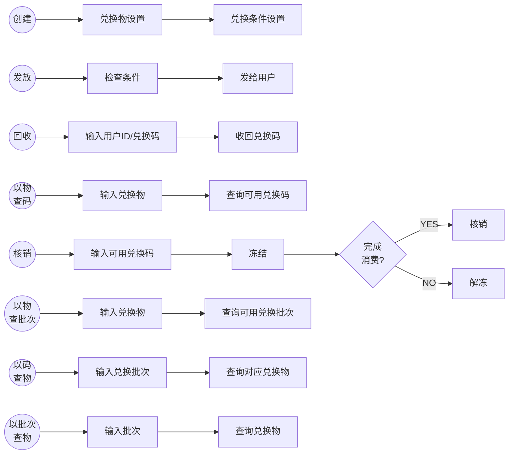

## 一、 背景

大促营销玩法多样，每新增一类营销玩法，均需要进行全链路，大规模变更。效率低，风险高

## 二、目标

（1）通过将用户权益（特权或福利）抽象，支持多样优惠**代币化**，简化优惠计算对底层优惠多样性的感知；

（2）通过代币化**的兑换码，可在后期的【会员权益】上扩展权益兑换功能；

## 三、 概要设计

###1. 概念

- 兑换码：资产（特权或福利）的**等价交换物**，可直接核销，也可兑换为兑换物核销。兑换码与其他营销工具比，更有灵活的流通性
- 兑换物：可通过兑换码进行兑换的资产（券、积分、奖励金）、特权（折扣、卡）、福利（商品）、账户（余额、现金）

### 2. 兑换核心业务逻辑



### 3. 领域模型


###3. 兑换码状态

| 原状态 | 可流转状态    | 说明                           |
| :----- | :------------ | ------------------------------ |
| 1 正常 | 2 解绑 3 冻结 | 初始态                         |
| 2 解绑 | -             | 被回收                         |
| 3 冻结 | 1 正常 4 核销 | 解冻进入正常态、核销进入核销态 |
| 4 核销 | -             | 被核销                         |

## 四、详细设计

### 1. 系统架构

### 2. 技术架构

### 3. 详细流程

#### （1）创建兑换码

<略>

#### （2）发放兑换码、回收兑换码

####（3）核销、冻结、解冻、消费兑换码

####（4）用户兑换码查询（可用、过期、已用）

####（5）兑换物对应兑换码查询

####（6）核销&解冻状态回调

### 4. DB设计

> 兑换码批次表、核销规则表、发放流水表（分表）、核销流水表（分表）

#### (1)兑换批次

兑换码标识、兑换码名称、兑换物类型（商品、券、折扣）、开始时间、结束时间、个数、兑换物ID（商品包ID、批次ID）、兑换物价值类型（固定、计算）、价值计算策略、核销规则ID、业务扩展

#### (2)核销规则表

规则ID、规则KEY（城市、品类ID、兑换物ID）、规则value

#### (3) 流水（分表1024）

兑换码标识、兑换码、用户ID、状态（核销、冻结）、绑定时间、过期时间、冻结时间、解冻时间、生效时间、活动ID、服务来源、核销规则（JSON）、核销对应的交易号、核销时间

> 交易号写入时机应该是在冻结的情况下进行、解冻的时候清除

### 5. 缓存设计

<服务端接口需要在合适的位置使用缓存>

## 五、系统接口

### 1.管理后台接口设计

#### （1）创建、修改兑换码 P1

```
创建兑换码 
METHOD: POST 
URI:/eva/cdkey/create 
REQUEST:
RESPONSE:
```

```
修改兑换码 
METHOD: POST 
URI:/eva/cdkey/modify
REQUEST:
RESPONSE:
```

####（2）兑换码详情查询  P2

```
回收兑换码 
METHOD: GET
URI:/eva/cdkey/detail
REQUEST:
RESPONSE:
```

####（3）兑换码上下线 p2

```
兑换码上线 
METHOD: POST 
URI:/eva/cdkey/online
REQUEST:
RESPONSE:
```

```
兑换码下线 
METHOD: POST 
URI:/eva/cdkey/offline
REQUEST:
RESPONSE:
```

### 2. 服务端接口设计 

#### （1）发放兑换码(P0)、回收兑换码(P3)

```
发放兑换码 
METHOD: POST 
URI:/eva/user/bind 
REQUEST:
RESPONSE:
```

```
回收兑换码 
METHOD: POST 
URI:/eva/user/unbind
REQUEST:
RESPONSE:
```

####（2）冻结、解冻、核销兑换码(P0)

```
冻结兑换码 
METHOD: POST 
URI:/eva/user/freeze
REQUEST:
兑换码(由优惠计算传入),
用户Id,
交易号,
RESPONSE:
```

```
解冻兑换码 
METHOD: POST 
URI:/eva/user/unfreeze
REQUEST:
RESPONSE:
```

```
核销兑换码 
METHOD: POST 
URI:/eva/user/consume
REQUEST:
RESPONSE:
```

####（3）用户兑换码查询（可用、过期、已用）(P0)

```
核销兑换码 
METHOD: GET
URI:/eva/user/cdkey/list
REQUEST:
RESPONSE:
```

####（4）核销&解冻状态回调 (P1)

>  (订单是否需要回调@向琦)

```
兑换码回调 
METHOD: POST
URI:/eva/cdkey/callback
REQUEST:
| 字段 | 类型 | 描述 |
用户ID,
兑换码,
交易码,
状态（核销、解冻）
RESPONSE:
```

####（5）兑换物对应兑换码查询(P0)（查流水表，）

> 优惠计算能不能拿到商品包

```
兑换物对应兑换码
METHOD: GET
URI:/eva/cdkey/list
REQUEST:
商品包Id，价格，用户Id，
RESPONSE:
商品包ID，原价，优惠价，兑换码，用户Id
```

## 六、稳定性

### （1）监控

###（2）降级

## 七、排期

13号联调