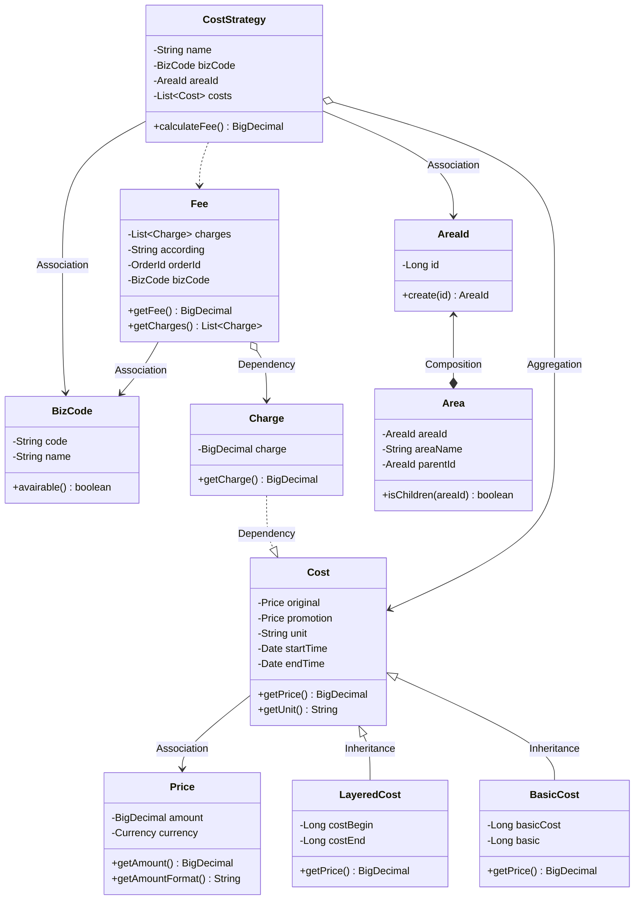
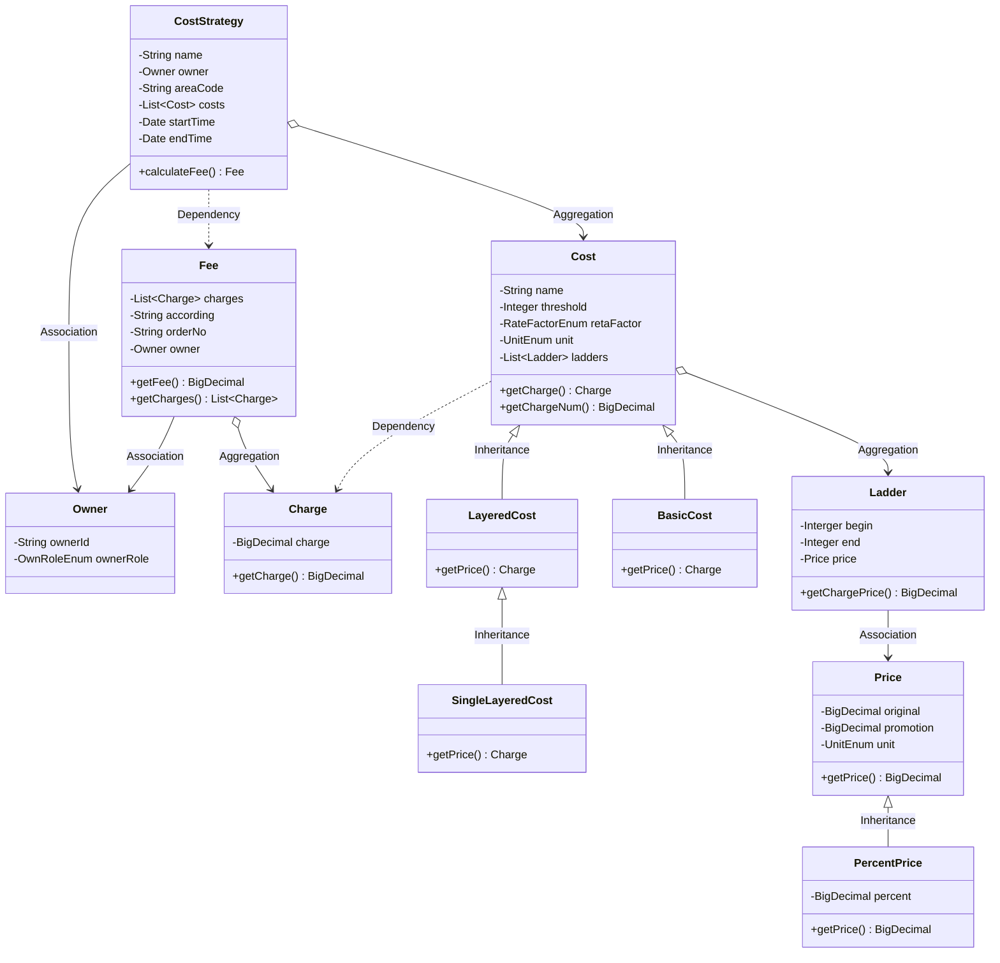

### 计费模型

```mermaid
classDiagram
class CostStrategy {
    -String name
    -BizCode bizCode
    -AreaId areaId
    -List~Cost~ costs
    +calculateFee() BigDecimal
}
class BizCode {
		-String code
		-String name
		+avairable() boolean
}
class AreaId {
		-Long id
		+create(id) AreaId
}
class Fee {
		-List~Charge~ charges
		-String according
		-OrderId orderId
		-BizCode bizCode
		+getFee() BigDecimal
		+getCharges() List~Charge~
}
class Charge {
		-BigDecimal charge
		+getCharge() BigDecimal
}
class Cost {
		-Price original
		-Price promotion
		-String unit
		-Date startTime
		-Date endTime
		+getPrice() BigDecimal
		+getUnit() String
}
class LayeredCost {
		-Long costBegin
		-Long costEnd
		+getPrice() BigDecimal
}
class BasicCost {
    -Long basicCost
    -Long basic
    +getPrice() BigDecimal
}
class Area {
    -AreaId areaId
    -String areaName
    -AreaId parentId
    +isChildren(areaId) boolean
}
class Price {
    -BigDecimal amount
    -Currency currency
    +getAmount() BigDecimal
    +getAmountFormat() String
}
Fee --> BizCode : Association
CostStrategy --> BizCode : Association
CostStrategy --> AreaId : Association
AreaId <--* Area : Composition
CostStrategy o--> Cost : Aggregation
Cost --> Price : Association
Cost <|-- LayeredCost : Inheritance
Cost <|-- BasicCost : Inheritance
Charge ..|> Cost : Dependency
Fee o--> Charge : Dependency
CostStrategy ..> Fee
```

修改后：

```mermaid
classDiagram
class CostStrategy {
    -String name
    -Owner owner
    -String areaCode
    -List~Cost~ costs
    -Date startTime
    -Date endTime
    +calculateFee() Fee
}
class Owner {
		-String ownerId
		-OwnRoleEnum ownerRole
}
class Fee {
		-List~Charge~ charges
		-String according
		-String orderNo
		-Owner owner
		+getFee() BigDecimal
		+getCharges() List~Charge~
}
class Charge {
		-BigDecimal charge
		+getCharge() BigDecimal
}
class Cost {
    -String name
		-Integer threshold
		-RateFactorEnum retaFactor
		-UnitEnum unit
		-List~Ladder~ ladders
		+getCharge() Charge
		+getChargeNum() BigDecimal
}
class LayeredCost {
		+getPrice() Charge
}
class BasicCost {
    +getPrice() Charge
}
class SingleLayeredCost {
		+getPrice() Charge
}
class Ladder {
    -Interger begin
    -Integer end
    -Price price
    +getChargePrice() BigDecimal
}
class Price {
    -BigDecimal original
    -BigDecimal promotion
    -UnitEnum unit
    +getPrice() BigDecimal
}
class PercentPrice {
    -BigDecimal percent
    +getPrice() BigDecimal
}
Fee --> Owner : Association
CostStrategy --> Owner : Association
CostStrategy o--> Cost : Aggregation
Cost o--> Ladder : Aggregation
Ladder --> Price : Association
Price <|-- PercentPrice : Inheritance
Cost <|-- LayeredCost : Inheritance
LayeredCost <|-- SingleLayeredCost : Inheritance
Cost <|-- BasicCost : Inheritance
Cost ..> Charge : Dependency
Fee o--> Charge : Aggregation
CostStrategy ..> Fee : Dependency
```

