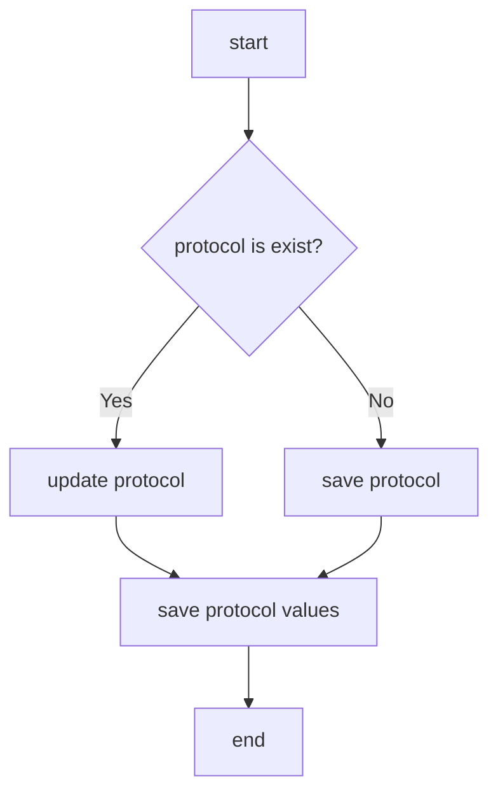
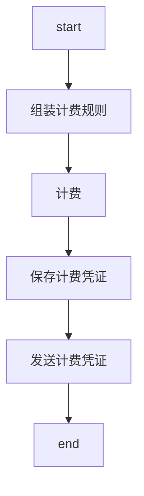
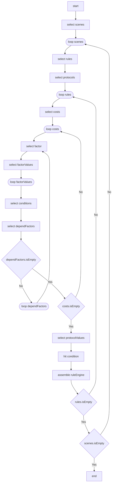
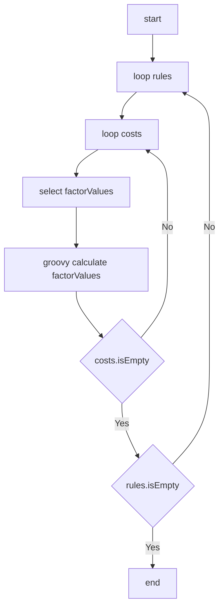

#### 同步计费协议

```mermaid
flowchart TD
A[start] --> B{protocol is exist?}
B -->|Yes| C[update protocol]
B --> |No| D[save protocol]
C --> E[save protocol values]
D --> E
E --> F[end]
```

#### 计费流程

##### 主流程

```mermaid
flowchart TD
A[start] --> B[组装计费规则]
B --> C[计费]
C --> D[保存计费凭证]
D --> E[发送计费凭证]
E --> F[end]
```

##### 子流程 - 组装计费规则（产出领域模型）

```mermaid
flowchart TD
A[start] --> B[select scenes]
B --> C([loop scenes])
C --> D[select rules]
D --> E[select protocols]
E --> F([loop rules])
F --> G[select costs]
G --> H([loop costs])
H --> I[select factor]
I --> J[select factorValues]
J --> K([loop factorValues])
K --> L[select conditions]
L --> M[select dependFactors]
M --> N{dependFactors.isEmpty}
N --> |No| P([loop dependFactors])
P --> I
N --> |Yes| O{costs.isEmpty}
O --> |Yes| T[select protocolValues]
T --> V[hit condition]
V --> U[assemble ruleEngine]
U --> Q{rules.isEmpty}

O --> |No| H
Q --> |Yes| R{scenes.isEmpty}
Q --> |No| F
R --> |Yes| S[end]
R --> |No| C
```

##### 子流程 - 计费

```mermaid
flowchart TD
A[start] --> B[loop rules]
B --> C[loop costs]
C --> D[select factorValues]
D --> E[groovy calculate factorValues]
E --> F{costs.isEmpty}
F -->|Yes| G{rules.isEmpty}
F -->|No| C
G -->|Yes| H[end]
G -->|No| B
```

