# 结算

[toc]

## 一、业务现状

### 当前现状

- 6类场景4个团队，烟囱式开发，一种场景搭一套

  - 六类场景：目前有团长、供应商、网格站、承运商、小店、用工6类结算场景

    ```mermaid
    flowchart TB 
    团长佣金结算
    供应商采购结算
    网格站配送结算
    承运商配送结算
    用工薪资结算
    小店加盟费结算
    ```

  - 四个团队：分别由团长团队（3人）、中台团队（5人）、普惠团队（5人）、采购团队（1人）研发（部分兼职），烟囱式开发

    

    ```mermaid
    flowchart TB 
    团长团队
    中台团队
    采购团队
    普惠团队
    ```

  - 职责不明导致新需求不知找哪个团队对接，部分场景计费结算问题收敛缓慢（@向敏）
- 同质的资金模块，重复开发，复用性低，研发效率低，后续升级扩展困难（@张哲 @向敏）
  - 各业务场景虽略有不同，产品方案上，多个模块可以统一设计和规划
  - 因技术团队分散，导致同质通用模块（例如计费、清结算）重复开发
  - 缺乏整体的规划，底层通用模块建设动力不足，模块难以复用，不利于后续升级和扩展性

### 面临挑战

- 如何快速响应结算业务需求，解决业务痛点（资源集中，统一调度）
- 在满足业务前提下，如何快速沉淀公共能力，提升复用率和人效（基础建设）
- 来自多个团队成员，如何融为一体，做到使命驱动（忠于目标，成事）

## 二、系统现状

### 小店加盟费

#### 架构简图

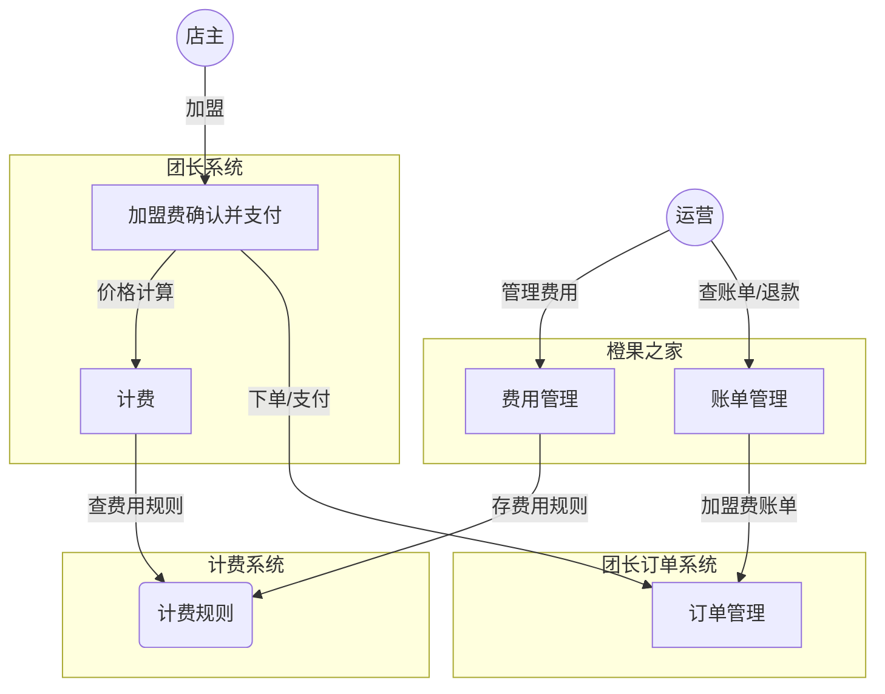

#### 模式分析

- 1、运营：费用管理（设计计费规则、费用类型）
- 2、团长系统：加盟费计费（套餐选择、费用明细）
- 3、运营：管理加盟费账单（查看账单、退款）

### 网格站计费

#### 架构简图

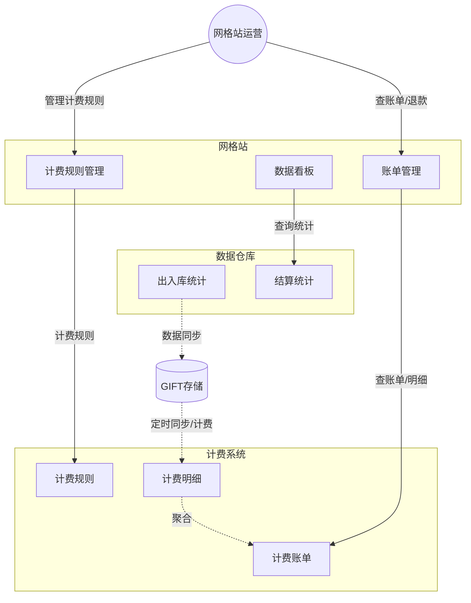

#### 模式分析

- 1、运营：计费规则管理（设计计费规则、费用类型）
- 2、数仓：出入库统计
- 3、计费系统：计费，产出计费明细，聚合成计费账单
- 4、运营：计费账单管理（查看、退款）
- 5、财务：线下打款

### 承运商计费

#### 架构简图

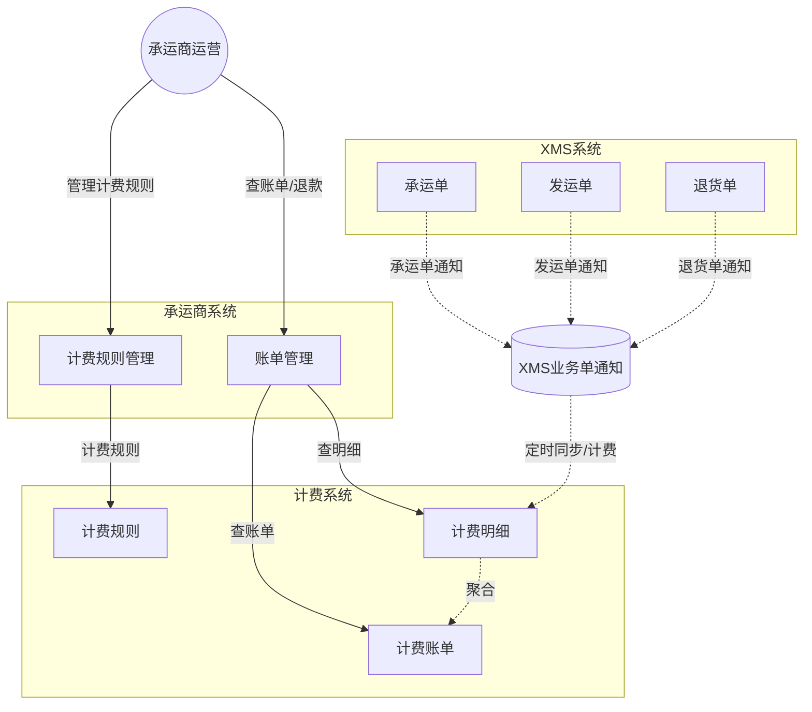

#### 模式分析

- 1、运营：计费规则管理（设计计费规则、费用类型）
- 2、XMS：业务单通知
- 3、计费系统：计费，产出计费明细，聚合成计费账单
- 4、运营：计费账单管理（查看、退款）
- 5、财务：线下打款

### 用工薪资结算

#### 架构简图

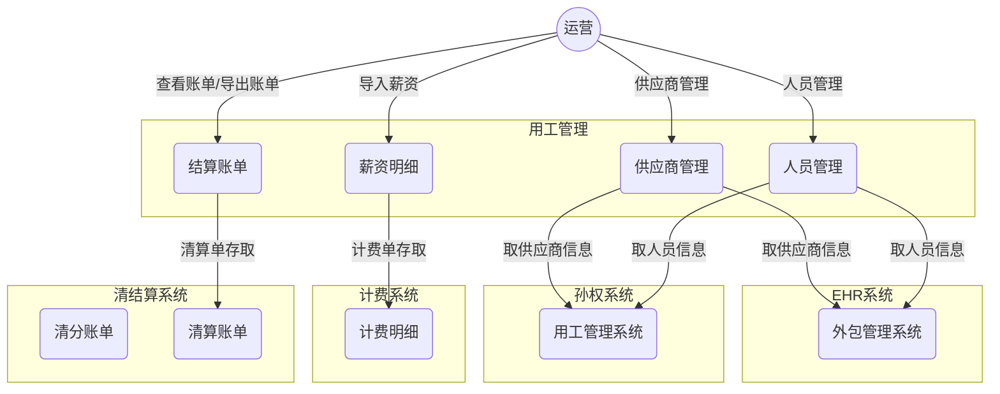

#### 模式分析

- 1、运营：人员管理、供应商管理、导入薪资明细
- 2、计费系统：产出计费明细
- 4、运营：账单管理（查看、导出）
- 5、财务：线下打款

### 供应商结算

#### 业务分析

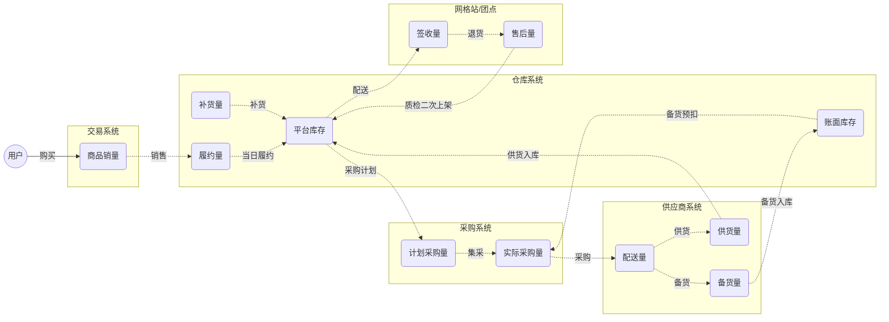

#### 计算方法

##### 销采模式

结算金额 = (履约量 + 补货量 - 仓前缺货量) * 物品采购价 * (1 - 承诺损耗率) - 售后量（供应商原因） * 物品采购价

- 仓前缺货量 = 实际采购量 - 供货量 = 计划采购量 - 账面库存 =  
- 履约量 + 补货量 - 平台库存 > 账面库存，结算金额 =  (账面库存 + 供货量) * 物品采购价 * (1 - 承诺损耗率) - 售后量（供应商原因） * 物品采购价
- 履约量 + 补货量 - 平台库存 <= 账面库存，结算金额 =  (履约量 + 补货量 - 平台库存) * 物品采购价 * (1 - 承诺损耗率) - 售后量（供应商原因） * 物品采购价

##### 集采模式

结算金额 = (履约量 + 补货量 - 仓前缺货量 - 平台库存) * 物品采购价 * (1 - 承诺损耗率) - 售后量（供应商原因） * 物品采购价

#### 模式分析

- 1、运营：采购
- 2、供应商：报价、供货
- 4、结算：采购结算（供货结算，退货扣款）、打款

### 团长结算

#### 系统简图

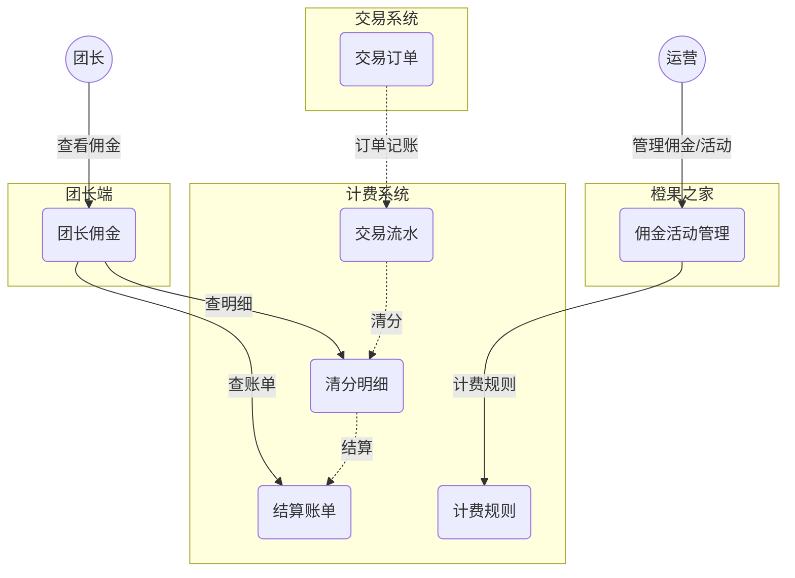

#### 模式分析

- 运营：设置佣金，管理活动
- 团长：导流，推广
- 用户：下单、支付
- 结算：计费、清分、结算
- 团长：获得佣金和奖励

## 三、系统设计

### 业务分析

以上场景，诉求同质化，集中在资金管理系统建设

- 业务板块：供应商、承运商、网格站、团长结算、用工结算、小店加盟可按业务视角定制
- 核心模块：沉淀计费规则管理、费用（及明细）管理、账单管理（含退货）、账务统计（即数据看板）为各业务版本服务
- 基础模块：构建记账、计费、清分、清算、结算的计费结算体系完成计费、清结算业务处理

### 系统简图

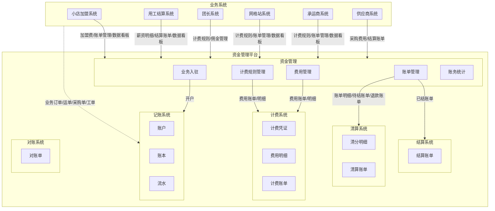


### 业务流程

#### 计费结算处理流程

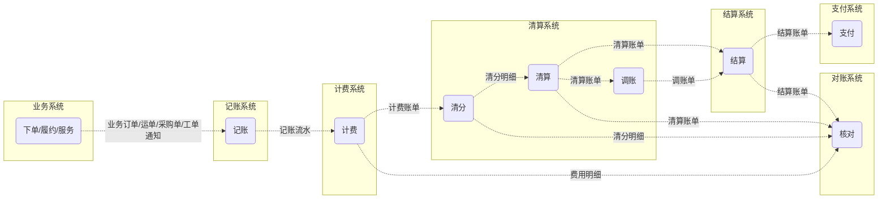

#### 计费结算产出物

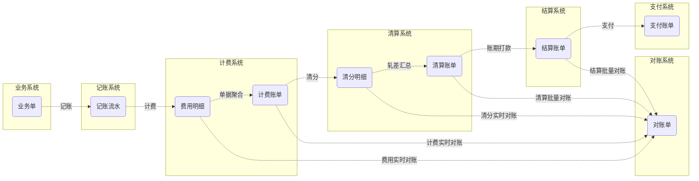

#### 状态流转

**交易订单状态流转**

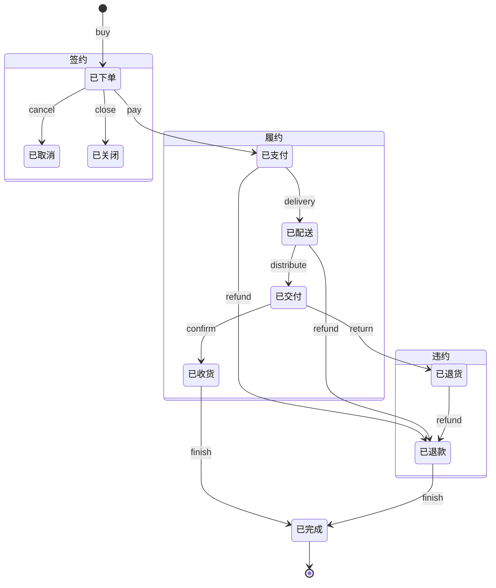


**计费结算状态流转**


#### 实体关系

| 实体            | 名称       | 语义                                                         |
| --------------- | ---------- | ------------------------------------------------------------ |
| BizOrderNo      | 业务订单号 | 对于应订单号、运单号、采购单号、工单号等，全局唯一，业务订单应有业务发生时间，该时间用作计费、清算、结算的依据 |
| Voucher         | 记账流水号 | 即业务流水号，被计费当做计费凭证                             |
| Charging_Item   | 费用明细   | 每条明细都应指向一条业务流水号（Voucher），作为计费的凭证，同时关联具体的费用（Charge） |
| Charging_Bill   | 计费账单   | 按业务流水号（Voucher）聚合多条费用明细（Charging_Item）     |
| Clearing_Item   | 清分明细   | 将费用（Charge）记录到结算主体（团长、供应商、承运商、网格站等）账户（待清算账户）上---应收应付 |
| Settling_Bill   | 清算账单   | 待清算账户中的费用流水，按结算周期（日、周、月）做轧差、汇总，记录一条清算账单（含待结金额和结算周期）到清算账户，清算账户也称之为待结算账户          --应收应付 |
| Settlement_Bill | 结算账单   | 待结算账户的流水，经过账期（例如T+N）后，发起打款，记录一条结算账单到结算账户 |


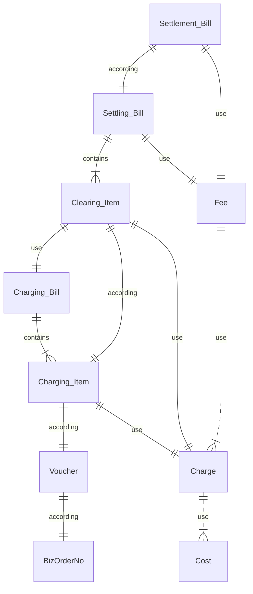


#### 数据模型

// 待完善

### 详细设计

#### 记账模型

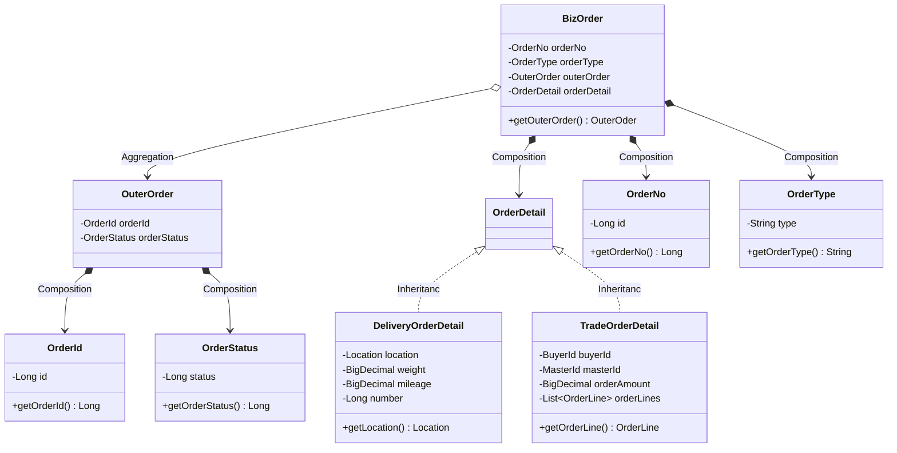

#### 计费费用模型

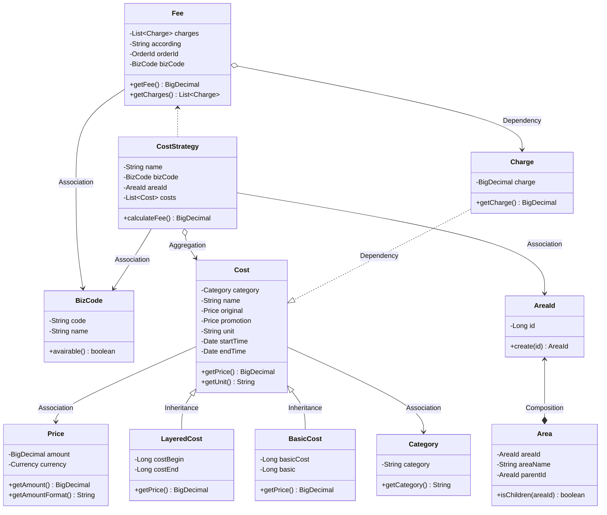


#### 计费账单模型

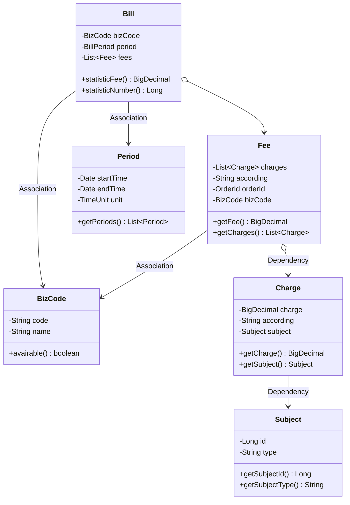

## 四、执行落地

### 建设思路

- 1、按业务分Owner：熟悉的1-2人做Owner，开发资源共享，快速解决业务痛点
- 2、分模块建设：组织中坚力量，在原系统基础之上孵化基础通用模块，建模、深耕
- 3、借事修人：一起打仗一起做成事，借成事修炼团队，提升团队凝聚力

### 需要帮助

- 需要各位老板给人，固定且全职投入
- 通用模块需要时间沉淀，前期要加大投入