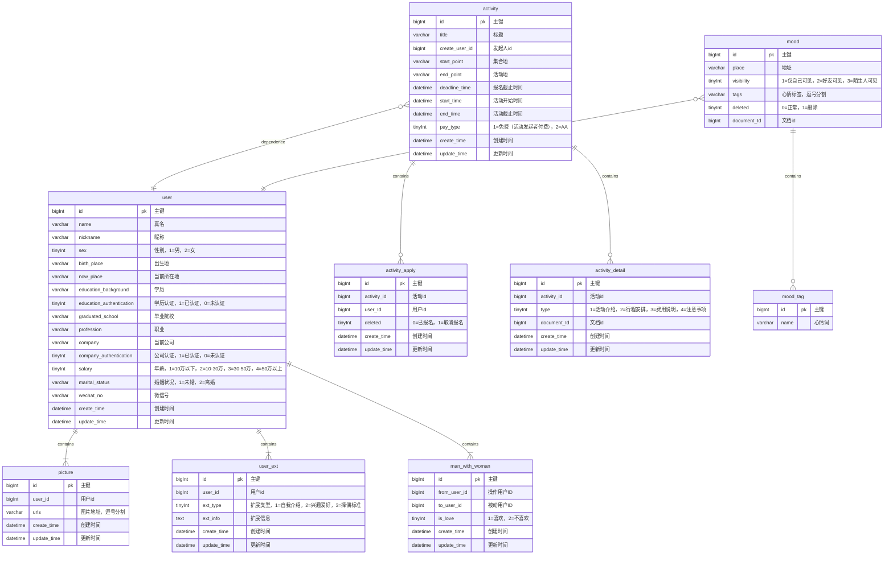

```mermaid
erDiagram
user ||--|{ picture: contains
user ||--|{ user_ext: contains
user ||--|{ man_with_woman: contains
activity o{--|| user: dependence
activity ||--o{ activity_apply: contains
activity ||--o{ activity_detail: contains
mood o{--|| user: dependence
mood ||--o{ mood_tag: contains
user {
	bigInt id pk "主键"
	varchar name "真名"
	varchar nickname "昵称"
	tinyInt sex "性别，1=男，2=女"
	varchar birth_place "出生地"
	varchar now_place "当前所在地"
	varchar education_background "学历"
	tinyInt education_authentication "学历认证，1=已认证，0=未认证"
	varchar graduated_school "毕业院校"
	varchar profession "职业"
	varchar company "当前公司"
	tinyInt company_authentication "公司认证，1=已认证，0=未认证"
	tinyInt salary "年薪，1=10万以下，2=10-30万，3=30-50万，4=50万以上"
	varchar marital_status "婚姻状况，1=未婚，2=离婚"
	varchar wechat_no "微信号"
	datetime create_time "创建时间"
	datetime update_time "更新时间"
}
user_ext {
	bigInt id pk "主键"
	bigInt user_id "用户id"
	tinyInt ext_type "扩展类型，1=自我介绍，2=兴趣爱好，3=择偶标准"
	text ext_info "扩展信息"
	datetime create_time "创建时间"
	datetime update_time "更新时间"
}
picture {
	bigInt id pk "主键"
	bigInt user_id "用户id"
	varchar urls "图片地址，逗号分割"
	datetime create_time "创建时间"
	datetime update_time "更新时间"
}
man_with_woman {
	bigInt id pk "主键"
	bigInt from_user_id "操作用户ID"
	bigInt to_user_id "被动用户ID"
	tinyInt is_love "1=喜欢，2=不喜欢"
	datetime create_time "创建时间"
	datetime update_time "更新时间"
}
activity {
	bigInt id pk "主键"
	varchar title "标题"
	bigInt create_user_id "发起人id"
	varchar start_point "集合地"
	varchar end_point "活动地"
	datetime deadline_time "报名截止时间"
	datetime start_time "活动开始时间"
	datetime end_time "活动截止时间"
	tinyInt pay_type "1=免费（活动发起者付费），2=AA"
	datetime create_time "创建时间"
	datetime update_time "更新时间"
}
activity_apply {
	bigInt id pk "主键"
	bigInt activity_id "活动id"
	bigInt user_Id "用户id"
	tinyInt deleted "0=已报名，1=取消报名"
	datetime create_time "创建时间"
	datetime update_time "更新时间"
}
activity_detail {
	bigInt id pk "主键"
	bigInt activity_id "活动id"
	tinyInt type "1=活动介绍，2=行程安排，3=费用说明，4=注意事项"
	bigInt document_Id "文档id"
	datetime create_time "创建时间"
	datetime update_time "更新时间"
}
mood {
	bigInt id pk "主键"
	varchar place "地址"
	tinyInt visibility "1=仅自己可见，2=好友可见，3=陌生人可见"
	varchar tags "心情标签，逗号分割"
	tinyInt deleted "0=正常，1=删除"
	bigInt document_Id "文档id"
}
mood_tag {
	bigInt id pk "主键"
	varchar name "心情词"
}
```

