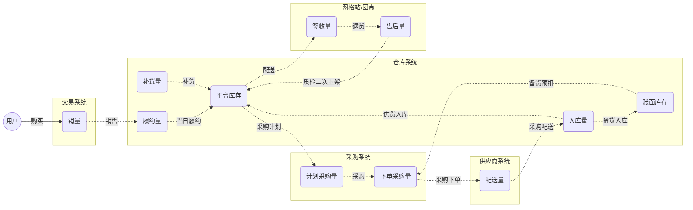
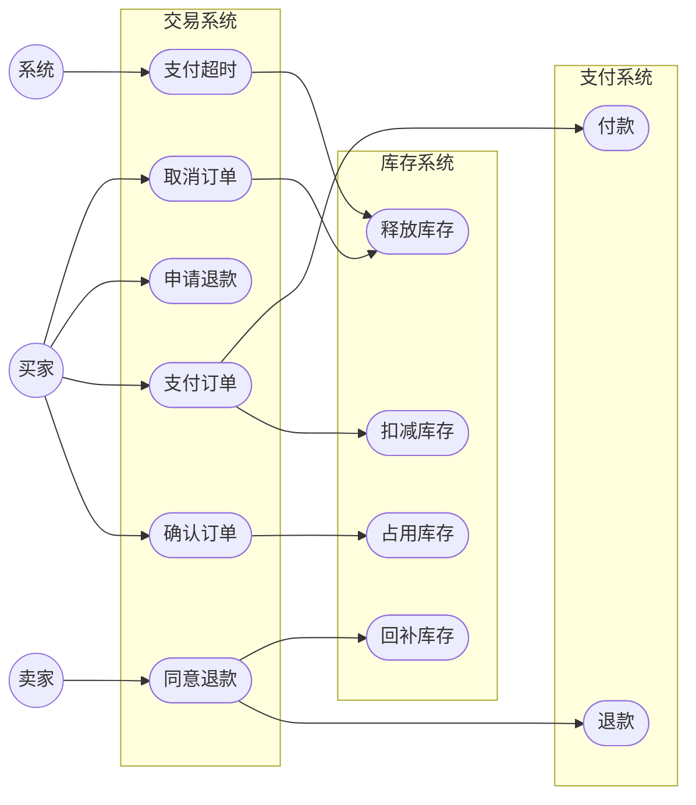
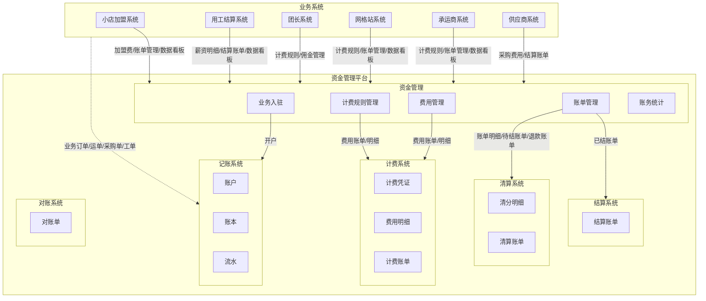
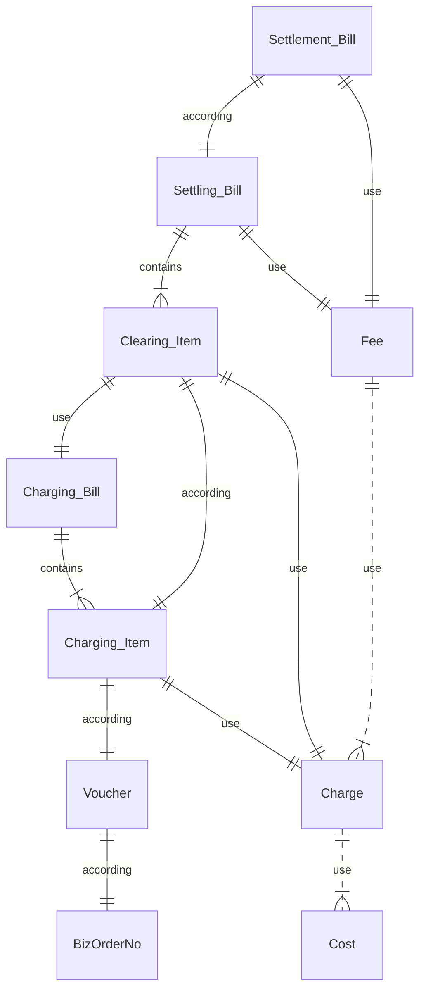
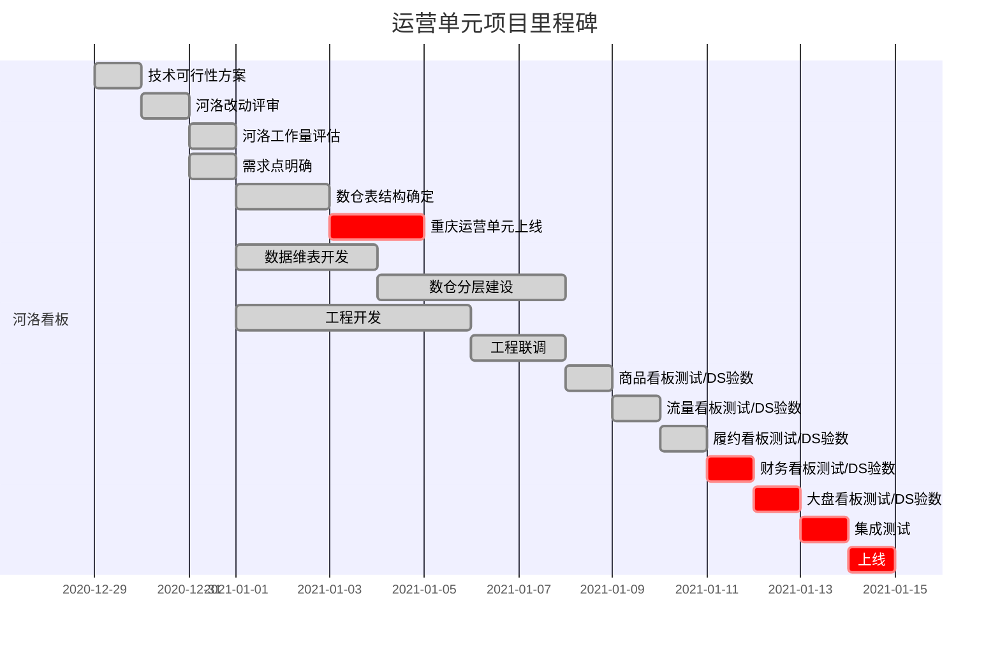

# 技术方案模板

[toc]

## 一、业务价值分析
### 1、业务需求

<!-- 业务需求（必选）：描述业务目标和业务价值 -->

#### 目标&价值

- 业务目标：这里描述业务目标
- 业务价值：这里描述业务痛点以及带来的业务价值

#### 需求文档

- [业务需求描述（MRD）](https://www.yourdomain.com/mrd)
- [产品需求文档（PRD）](https://www.yourdomain.com/prd)

### 2、交互视觉

<!-- 交互视觉（可选）：引入交互和视觉 -->

- [交互稿](https://www.didiglobal.com/)
- [视觉稿](https://www.didiglobal.com/)

## 二、需求分析
### 1、名词定义
<!-- 定义名词（必选）：这里定义我们使用到的专业名词 -->

名词|定义
----|----
业务流程|定义业务流程，一般可从关键概念的生命周期来考虑
业务主流程|定义业务流程主要程序，主流程可细分为子流程
业务子流程|定义业务主流程一个流程节点的流转程序，一般由业务场景串联起来

### 2、业务流程
<!-- 定义业务流程，必选 -->

**结算商品量业务流程（例）**



### 3、用例分析
#### 用例图

<!-- 用例图（必选）：描述角色以及角色与用例之间的连接关系。说明的是谁要使用系统，以及他们使用该系统可以做些什么。一个用例图包含了多个模型元素，如系统、参与者和用例，并且显示了这些元素之间的各种关系，如泛化、关联和依赖。 -->



#### 用例描述

<!-- 用例描述业务用例，可选 -->

**订单确认用例（例）**

用例项|用例描述|
---|---|
用例id|【需要编码规则】
用例名称|【用例名】
创建者|
创建日期|
最后更新者|
最后更新时间|
参与者（角色）|【用例的参与角色】
功能描述|【概要的对功能进行描述】
前置条件|【用例的前置条件】
后置条件|【用例的后置天剑】
主干过程|【描述正常、一般情况下的动作序列】
分支过程|【主干过程中的分支动作序列】
异常|【主干或分支过程中出现异常的动作序列】
包含|【用例包含的其他用例】
业务规则|【用例中用到的业务规则，例如计算公式】
特别需求|【性能、可用性等方面的需求】
假设|【用例中，我们做了哪些假设】
注意&问题|【还有哪些未确定的事项】

## 三、技术选型

<!-- 系统之间的职责、边界和关系描述 -->

### 1、行业对标
<!-- 业内采用方案，及其优缺点，可选，但强烈推荐 -->

### 2、解决方案
<!-- 本案采用方案，及其优缺点，必选，C4系统级或容器级架构图 -->



### 3、分析模型
<!-- 分析模型，领域 + 限界上下文 + 上下文映射，可选 -->

#### 职责边界关系

<!-- 这里描述系统的职责（功能）、边界（范围）、关系（集成或依赖关系） -->

- xx系统：提供xx
- yy系统：提供yy

### 4、服务接口
**xx接口**

- 系统：xx系统
- 定义：接口服务能力描述

## 四、概要设计

<!-- 概要设计：单个系统的框架设计 -->

### 1、概念模型
<!-- 简称ER图，描述关键对象（实体）之间的关系，可选 -->



### 2、微服务设计
<!-- API设计：确定API定义，系统设计者必选，此处定义系统交互接口 -->

**xx接口**

- 定义：接口服务能力描述
- [api](https://git.xiaojukeji.com/amonline_energy/energy-doc/blob/master/standard/api-standard/api_path_name_standard.md)： `http://${domain}/api/order/buy`
- 输入

```json
{}
```
- 输出

```json
{}
```

### 3、稳定性设计
<!-- 稳定性设计：参考稳定性建设方案，可选 -->

- 限流
- 超时熔断
- 监控报警
-	容量规划

### 4、安全性设计
<!-- 安全性设计：安全性考虑，可选 -->
-	攻击漏洞
-	操作权限
-	数据泄露
-	信息脱敏

## 五、详细设计

<!-- 详细设计：确定对象的行为（方法）和数据（属性），可选 -->

### 1、设计模型
#### 领域模型
<!-- 领域能力：确定领域对象及关系，及确定领域服务行为，可选 -->

#### 类图
<!-- 类图：确定对象的行为（方法）和数据（属性），可选 -->

#### 时序图
<!-- 时序图：确定对象调用的关系和顺序，可选 -->

#### 状态图
<!-- 状态图：描述状态流转、事件触发，可选 -->

### 2、数据模型

- 表名: user

字段名 |类型长度| 含义
---|---|---
id | bigint |用户id
create_time|datetime|创建时间
update_time|datetime|修改时间

### 3、数据驱动
<!-- 定义可衡量业务价值的指标及计算方法，可选 -->

## 六、项目计划
### 1、工作量
<!-- 此处评估系统1的变更功能点改造工作量（工作量评估精确到1.0人日）-->

**总工作量**

- 处理节点1（2.5）
  - 功能点1.1（1.5）
    - 任务1.1.1（0.5）
    - 任务1.1.2（1.0）
  - 功能点1.2（1.0）
    - 任务1.2.1（0.5）
    - 任务1.2.2（0.5）
- 处理节点2（2.0）
  - 功能点2.1（2.0）
    - 任务2.1.1（1.0）
    - 任务2.1.2（1.0）

### 2、里程碑
<!-- 里程碑（必须）：此处列举关键里程碑 -->

- 10.08：业务MRD评审完成
- 10.10：需求PRD评审通过
- 10.13：技术方案评审
- 10.14：视觉评审通过
- 10.15：项目排期确定
- 10.16：投入开发
- 10.24：开发完成
- 10.25：联调完成
- 10.28：测试完成
- 10.30：部署上线
- 10.31：灰度发布

### 3、甘特图
<!-- 甘特图（必须）：此处放置项目甘特图 -->



### 4、上线方案

<!-- 上线方案（必选）：此处定义上线的先后顺序以及回滚方案 -->

#### 上线步骤

- 步骤1：xx
- 步骤2：xx
- 步骤3：xx

#### 回滚方案

- 1、xxx
- 2、xxx