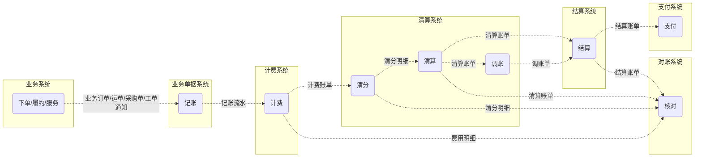
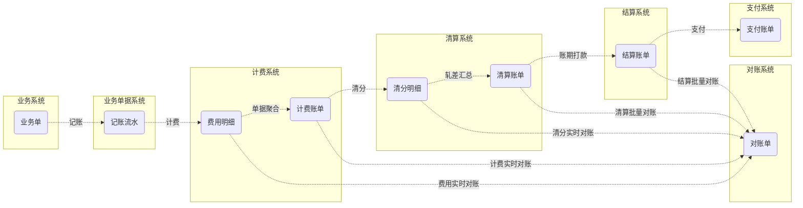

#### 系统架构

#### 计费结算处理流程

#### 计费结算产出物

#### 项目介绍

normalizer: 业务单据系统。接入业务方业务消息，进行记录、清洗、补全、汇总，产出统一业务单据消息，发送给计费系统

charging：计费系统。接收业务单据消息，进行规则匹配，产出计费账单

clearing：清算系统。接收计费明细，用于清分和清算。清分-按费用类型分账，产出清分明细。清算-按账期清算，产出清算账单

settlement：结算系统。接收清算账单，用于调账、支付。调账-创建调整单，与清算账单一起结算。支付-尚无，接入的是集团云影系统进行开票和支付。

reconciliation：对账系统，暂无

背景：当时很多业务部门都有结算需求，比如：配送的司机结算、仓储结算、供应商结算、团长佣金、小店加盟费、用工薪资等多个场景。但是都是各搞各的，代码重复，人效利用率低。

目标：所以当时公司就想成立一个结算中台，来统一承接所有场景的结算需求。

行动：这个活就被我们老板承接下来了。我们接到这个任务之后一边承接业务需求，理解领域知识。一边就是组内讨论，沉淀领域模型，并进行最小模型验证。经过一段时间的努力，搭建出了一套适应多场景的结算体系。大致分为五个系统。

结果：极大的提高的人效，后续承接需求不需要再对每个需求都进行个性化开发（因为计费结算其实是一个业务规则特别复杂的系统，每个场景的结算与计费规则都不相同。）。只需要进行简单的配置，与少量的开发即可。在稳定性与数据一致性上亦得到了巨大的提升。

#### 场景举例

###### 1、承运商业务场景

计费因素：车型、里程、重量、团点、逆向团点、是否复跑、起步价（团点起步、里程起步）、折算比、出勤天数

费用结算：

- 总费用=基础费用 * 折算比 * 复跑系数（如果复跑该数0.8，不复跑该数1）+ 出勤补贴
- 折算比=max(max(正向团点数 /30 , 结算重量/0.48) , 1)
- 基础费用=起步价+续团费+续里程费+续重费+逆向运费
- 出勤补贴=（if > 20 = 500 ; if > 25 = 700 ; if > 30 = 1000）
- 续团费=续团点*续团单价
- 续里程费=续里程*续里程单价
- 续重费=续重量 * 续重单价
- 续团点=团点-起步团点
- 续里程=里程-起步里程
- 续重=重量-起步重量

#### 亮点

###### 1、统合多业务场景，配置化规则

- 业务高度抽象，领域划分清晰，适配公司承运商、网格站、供应商、团长、用工薪资、小店等多个业务场景
- 计费、清结算规则动态配置，可一键产出相应账单。对账可视化
- 加、减、乘、除、if、max、min多操作符，基本可以适配所有计费场景

#### 难点

   ###### 1、领域知识匮乏，业务场景多样化，领域模型沉淀困难

由于当时我们整个团队都是从增长抽过去的，对结算这一块的业务完全不熟。当时就一边承接业务需求，一边通过问人（结算产品和以前的开发）、调研（网上搜索博客）、看书（世界上最简单的会计书）等了解当前的结算业务场景与结算术语（比如什么是清分、清算、轧差）。大约经过一两个月我们才对整个结算轮廓有个大体的认识，期间产出了多版模型。一次次经过最小模型验证，一次次再推翻。最终产出了上面的这一套计费、清结算体系架构。

###### 2、计费如何适配多场景?阶梯怎么办？总量阶梯呢

- 这么多业务场景，每个场景规则都不一样，同一场景的规则可能也不一样，该如何算钱？抽出场景、规则、计费项、计费表达式、计费因子。所有元素皆是因子
- 阶梯怎么办？有的根据区间算，有的根据总量算。都是条件，引入easy-rule规则引擎

###### 2、如何保证消息不丢，如果处理消息丢失问题，数据一致性问题

本地消息表/事务消息。对账系统

#### 后续优化点

###### 1、对账系统尚无，账单只能通过业务自己核对，无法感知上游业务单据错误

描述：结算这块严重依赖上游的业务消息。我们自己领域类的计费异常我们可以感知并通过报警抛出（比如上游因子为空，或者规则配置错误）。但是如果上游消息传入的计费参数就是错误的（比如之前错了，他们自己通过DB修复了，但是没有给我们重发消息），这点我们无法感知到，只能通过业务自己核对出，我们再找上游重发消息，重跑产出新的账单。

解决：后续可以推动上游提供接口，我们通过拉的方式，按周期进行账单核对。

##### 2、对账系统构思

解决两个问题：1、上游因子错误，后续修复；2、上游漏单，后续修复（解决错账、单边（长款、短款）问题）

通过拉的方式拉取上游订单，通过源单号进行merge，排查出漏单，以及因子错误（重走计费系统，进行金额比对）。

数据获取 -> 数据标准化 -> 对账 -> 差异处理（标记成多种状态，对平、单边、错账），然后人工处理

###### 大数据量如何处理？

实时对账 + 账期对账。大部分数据尽量走实时对账，如果无法走，那么账期对账的时候考虑先汇总，再对账，缩小订单量。然后找出差异账单，再细分到相应明细标记出差异。主要是一个分治的思想，拆分+汇总

拆分：通过MQ将数据分片发送到对账集群，每个机器处理一部分数据。同时单台机器里使用多线程再次拆分。

为什么没有搞？

由于之前老板离职了，新老板要快速搞出成果，要以业务为主。业务容易出成果。而这种可能对后续的发展有帮助，但可能不是那么容易出成果。

后来又因为橙心业务收缩，业务场景简化，这一套可能就不太那么有价值。做任何东西我们都需要考虑它带来的价值，以为需要付出的成本。这个性价比就不高了。

现在的合伙人模式场景简单，有一套简单的对账看板，通过订单sku的维度，来关联各个售后单据，计费单据，产出一张宽表，进行展示。

3、消息丢失如何处理

本地消息表/事务消息

现行是推得模式，后面采用推+拉的模式，T+1通过拉进行补偿。